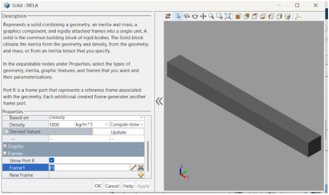
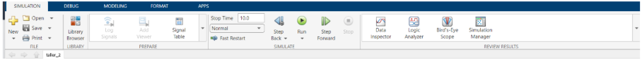
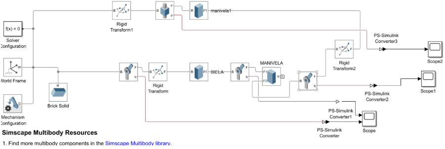
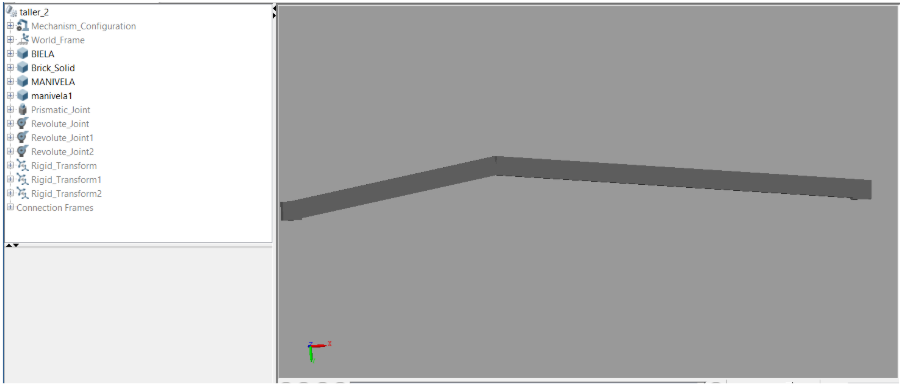
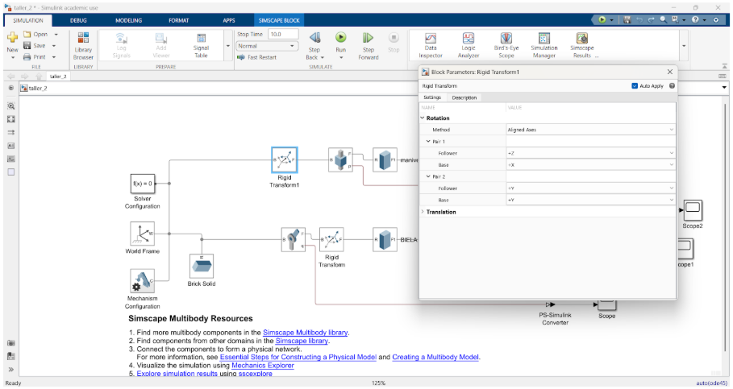
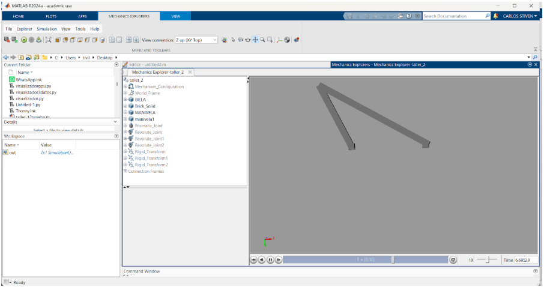
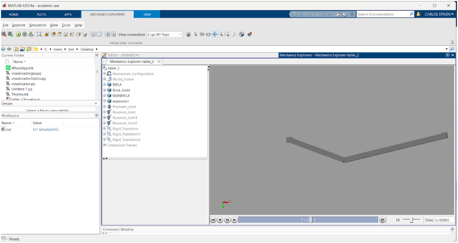
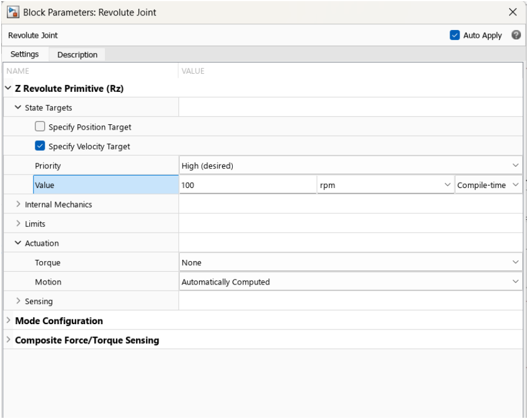
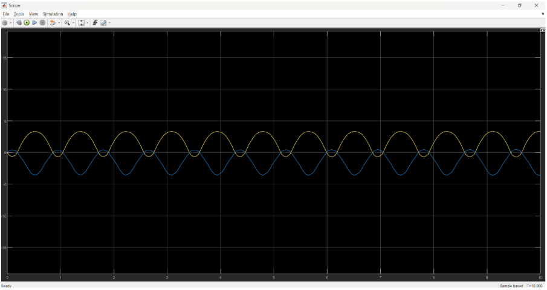

# clase-del-12-de-marzo
# Informe: Simulación de un Mecanismo Manivela-Biela en Simscape Multibody

## Introducción
Simscape Multibody es una herramienta de Simulink utilizada para modelar y simular sistemas mecánicos en 3D que permite analizar el comportamiento dinámico de mecanismos con cuerpos rígidos, articulaciones y fuerzas aplicadas, facilitando el diseño y optimización de sistemas mecánicos sin necesidad de formular ecuaciones manualmente.
---
### Sus principales características incluyen:
1. Modelado basado en bloques para representar componentes físicos.
2. Simulación dinámica con efectos como fricción y gravedad.
3. Integración con CAD y otros módulos de Simscape para simulaciones de multidominio.
4. Visualización 3D en tiempo real para analizar el movimiento del sistema.
---
Se aplica en robótica, automoción, biomecánica, aeroespacial y más. Para obtener simulaciones precisas, es clave definir correctamente propiedades físicas, restricciones y condiciones iniciales.

---

## ¿Cómo usar Simscape Multibody en MATLAB/Simulink?

### Paso 1: Abrir Simulink y Crear un Nuevo Modelo
1. Abre MATLAB y escribe en la barra de comandos:
    ```matlab
    simulink
    ```
2. Se abrirá Simulink. Haz clic en **"Blank Model"** (Modelo en Blanco).
3. Abre el **Library Browser** (Explorador de Bibliotecas) en la barra de herramientas.
4. Navega hasta **Simscape > Multibody** para acceder a los bloques necesarios.


---

## Paso 2: Construcción del Sistema Mecánico

La configuración inicial incluye:

- **Solver Configuration**: Define los parámetros del solucionador numérico.
- **World Frame**: Representa el sistema de referencia global.
- **Mechanism Configuration**: Configura las unidades y parámetros generales.

Los bloques principales utilizados son:

- **Brick Solid**: Cuerpo rígido con masa y dimensiones definidas.
- **Rigid Transform**: Permite definir la posición y orientación relativa de los cuerpos rígidos.
- **Simulink-PS Converter y PS-Simulink Converter**: Convierten señales entre Simulink y Simscape.
- **Scope**: Permite visualizar datos de la simulación.

### 1. Construcción del Sistema Mecánico
- Agrega cuerpos rígidos con el bloque **Solid**.
- Conéctalos con articulaciones como **Revolute Joint** o **Prismatic Joint**.
- Define propiedades como masa, inercia y geometría.



### 2. Agregar Componentes Básicos

| Bloque                | Función                                        |
|----------------------|----------------------------------------------|
| **World Frame**       | Define un punto de referencia global.         |
| **Solid**            | Representa un cuerpo rígido con propiedades físicas. |
| **Revolute Joint**   | Permite la rotación entre cuerpos.            |
| **Solver Configuration** | Necesario para ejecutar la simulación.     |

**Ubicación de los bloques en Simulink:**
- **Simscape > Multibody > Frames and Transforms → World Frame**
- **Simscape > Multibody > Bodies → Solid**
- **Simscape > Multibody > Joints → Revolute Joint**
- **Simscape > Utilities → Solver Configuration**

Para conectar los bloques, simplemente arrástralos y conéctalos con líneas.



---

## Paso 3: Configurar un Cuerpo Rígido
1. Haz doble clic en el bloque **Solid**.
2. Configura:
   - Masa y dimensiones del objeto.
   - Centro de masa.
   - Propiedades visuales como color o textura.



---

## Paso 4: Ejecutar la Simulación
1. Asegúrate de que los bloques están correctamente conectados.
2. Añade un **Solver Configuration** para evitar errores de simulación.
3. Presiona **Run** para iniciar la simulación.



---

## Análisis del Funcionamiento

### Componentes principales:
- **World Frame y Solver Configuration**: Definen el marco de referencia y los parámetros de simulación.
- **Brick Solid**: Representa un cuerpo sólido en el sistema.
- **Rigid Transform**: Configura transformaciones rígidas entre componentes.
- **Mecanismo de manivela y biela**: Permite la transmisión de movimiento.
- **PS-Simulink Converter**: Convierte señales físicas en Simulink para visualización en **Scopes**.

### Flujo del sistema:
1. Se establece el marco de referencia y los sólidos.
2. La **manivela y la biela** transmiten movimiento mediante transformaciones rígidas.
3. Se convierten señales físicas a Simulink para análisis en osciloscopios (**Scopes**).



---

## Resultados de la Simulación

### Configuración de la Revolute Joint
- Se ha establecido un **objetivo de velocidad de 100 rpm** en el eje **Z (Rz)**.
- El torque está configurado en **None**, permitiendo que el sistema calcule el movimiento automáticamente.



### Comportamiento del Sistema
- La imagen muestra la salida de un **Scope en Simulink**, donde se representan **dos señales sinusoidales**.
- El patrón periódico indica un **movimiento oscilatorio regular**.
- La diferencia de fase entre ambas curvas sugiere que corresponden a la posición angular de la **manivela y la biela**.



### Simulación con Diferentes Parámetros
- Se ha establecido un **objetivo de velocidad de 0 rpm**.
- Se observan los efectos en la transmisión del movimiento.



### Visualización en Simscape Multibody
- La imagen muestra la representación 3D del mecanismo en funcionamiento.



### Video del Funcionamiento
_Ahora vamos a agregar un video del funcionamiento._

📹 **[Ver Video](https://youtu.be/DjXFY_ks1yc)** _(enlace al video de la simulación)_

---

## Recursos Adicionales
Si necesitas más información, consulta la documentación oficial de MathWorks:
🔗 [Documentación Simscape Multibody](https://www.mathworks.com/help/physmod/sm/)
